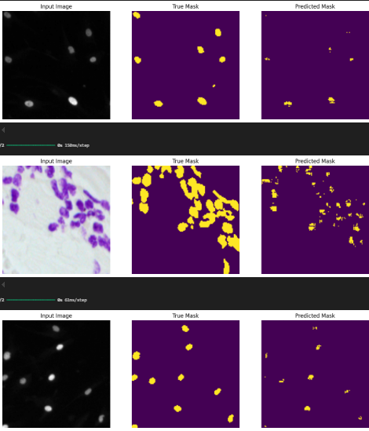
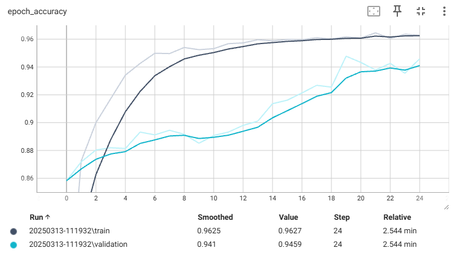
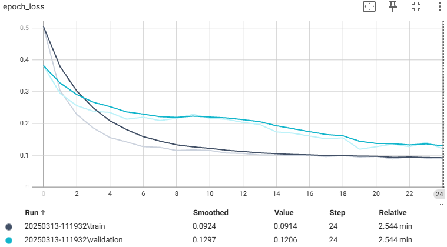

# Automated Nuclei Detection for Biomedical Research  

## Overview  

This project implements an **AI-based semantic segmentation model** to **automatically detect cell nuclei** in biomedical images. The ability to accurately identify nuclei is critical for **accelerating research** on various diseases, including **cancer, heart disease, and rare disorders**. By automating this process with a deep learning model, we aim to:  

- **Speed up drug discovery** by analyzing how cells respond to treatments.  
- **Enhance biological research** by enabling efficient examination of DNA within nuclei.  
- **Improve overall research efficiency** in medical and pharmaceutical studies.  

Our model is based on **U-Net**, a widely used convolutional neural network (CNN) architecture for image segmentation. The project follows a complete **machine learning pipeline**, including **data preprocessing, model training, evaluation, and deployment**.  

---

## Dataset  

- **Source**: [2018 Data Science Bowl - Kaggle](https://www.kaggle.com/competitions/data-science-bowl-2018/overview)  
- **Dataset File**: `data-science-bowl-2018.zip` (not included in this repository, download from Kaggle)  

The dataset contains labeled images of **cell nuclei** in various biological samples. It is used for training, validating, and testing our AI model.  

---

## Project Workflow  

1. **Problem Formulation**: Define the importance of nuclei detection and its real-world applications.  
2. **Data Preparation**:  
   - Load and preprocess images.  
   - Apply augmentation techniques to increase dataset variability.  
3. **Model Development**:  
   - Implement a **U-Net architecture** for nuclei segmentation.  
   - Use **transfer learning** for the downsampling path.  
   - Train with **early stopping** to prevent overfitting.  
   - Achieve **94%+ accuracy on both training and validation data**.  
4. **Model Evaluation**:  
   - Use performance metrics like **Accuracy and Loss**.  
   - Visualize segmentation results.  
5. **Model Deployment**:  
   - Save the trained model in `.keras` format.  
   - Use the model to **predict on test images**.  
   - Export and visualize predictions.  

---

## Model Architecture  

The **U-Net model** consists of:  
- **Encoder (Downsampling Path)**: Uses a **pre-trained model** for feature extraction (transfer learning).  
- **Decoder (Upsampling Path)**: Custom layers to reconstruct segmentation masks.  

### Model Summary  

- Input: **Biomedical images**  
- Output: **Binary mask identifying cell nuclei**  
- Loss Function: **Binary Cross-Entropy + Dice Loss**  
- Optimizer: **Adam**  

### Model Diagram  

  

*(Generated using `plot_model()` function from Keras.)*  

---

## Training & Performance  

- **Training & validation accuracy**: **>94%**  
- **Overfitting prevention**: Used **early stopping** and **data augmentation**.  
- **Performance Metrics**:  
  - **Accuracy**  
  - **Loss**  

---

## Repository Structure  

```
📂 automated-nuclei-detection  
├── 📂 dataset                   # Contains training and validation data  
├── 📂 image                     # Stores sample input/output images
│   ├── acc.png                     # Accuracy of the model training
│   ├── loss.png                    # Loss of the model training
│   ├── model.png                   # Architecture of the model
│   ├── sample_predictions.png      # Sample prediction of the model
├── 📂 logs                     # TensorBoard training logs  
├── 📂 model                    # Saved model architecture or weights  
│   ├── weight.keras                # Model architecture diagram  
├── train.ipynb                 # Jupyter Notebook for training and
├── .gitignore                  # Ignore the logs and dataset   
└── README.md                   # Project documentation  
```

### Notes:
- **`dataset/`**: Store training and validation images (not included in GitHub, refer to Kaggle link).  
- **`image/`**: Store smages.  
- **`logs/`**: TensorBoard logs to monitor training performance (not included in GitHub).
- **`model/weight.keras`**: Model weight.  
- **`train.ipynb`**: Jupyter Notebook for model training, evaluation, and prediction.  

---

## Results  

Here are sample segmentation results from our model:  

  

Here is the model accuracy while training



Here is the model loss while training


---

## Citations & References  

Credit to the dataset source:  

> [2018 Data Science Bowl - Kaggle](https://www.kaggle.com/competitions/data-science-bowl-2018/overview)  